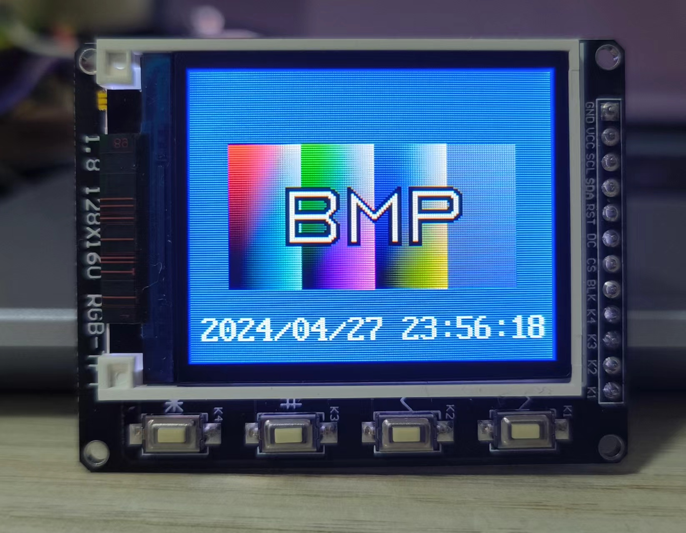
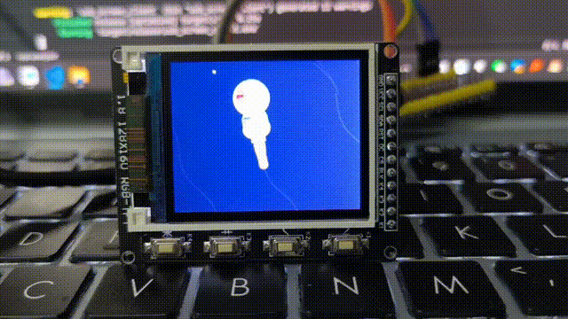

# rp2040_usb_screen
 rp2040 usb screen

RP2040 USB屏幕


# 图文教程:

# [https://zhuanlan.zhihu.com/p/698789562](https://zhuanlan.zhihu.com/p/698789562)

# 视频教程
# [https://www.bilibili.com/video/BV1eTTwe6EFU/?vd_source=a2700de3db7bd5f0117df32bdd5cef9f](https://www.bilibili.com/video/BV1eTTwe6EFU/?vd_source=a2700de3db7bd5f0117df32bdd5cef9f)

## 支持的屏幕型号

目前支持 ST7735 128x160 和 ST7789 320x240两种屏幕

### ST7735接线方式
```
    GND <=> GND
    VCC <=> 3V3
    SCL <=> SCLK(GPIO6)
    SDA <=> MOSI(GPIO7)
    RES <=> RST(GPIO14)
    DC  <=> DC(GPIO13)
    CS  <=> GND
    BLK <=> 不连接
```

### ST7789接线方式
```
    GND   <=> GND
    VCC   <=> 3V3
    SCL   <=> PIN6(clk)
    SDA   <=> PIN7(mosi)
    RESET <=> PIN14(rst)
    AO    <=> PIN13
    CS    <=> PIN9
    BL    <=> 5V
```

## 传输速度

使用USB虚拟串口 / USB Raw两种传输方式，传输速度最快 512K/S。

128x160屏幕绘制速度40帧/S左右，320x240屏幕绘制速度13帧左右.

## 传输协议

USB Raw和USB虚拟串口方式，协议都是相同的。图像数据格式为RGB565 BE（大端字节顺序）。

一共有3中指令："图像开始","图像结束","重启到U盘模式"

```rust
    //图像开始指令
    const IMAGE_AA:u64 = 7596835243154170209;
    //图像结束指令
    const IMAGE_BB:u64 = 7596835243154170466;
    //重启到U盘模式
    const BOOT_USB:u64 = 7093010483740242786;
```

传输图像只需要使用IMAGE_AA和IMAGE_BB指令，首先发送IMAGE_AA，以及对应的width,height,x,y。然后发送图像数据，最后发送IMAGE_BB。即可显示这幅图像。

为了提高帧率，图像数据需要用lz4压缩后再传输。

以下代码在20,20左上角位置，显示一张60x60的图像
```rust
    //执行lz4压缩
    let rgb565_u8_slice = lz4_flex::compress_prepend_size(rgb565);
    
    const IMAGE_AA:u64 = 7596835243154170209;
    const IMAGE_BB:u64 = 7596835243154170466;

    //发送图像开始指令
    //图像开始指令8字节，然后写入宽、高、x坐标、y坐标(u16 BE)
    let img_begin = &mut [0u8; 16];
    img_begin[0..8].copy_from_slice(&IMAGE_AA.to_be_bytes());
    img_begin[8..10].copy_from_slice(&width.to_be_bytes());
    img_begin[10..12].copy_from_slice(&height.to_be_bytes());
    img_begin[12..14].copy_from_slice(&x.to_be_bytes());
    img_begin[14..16].copy_from_slice(&y.to_be_bytes());
    
    port.write(img_begin)?;
    port.flush()?;
    //发送图像数据
    port.write(&rgb565_u8_slice)?;
    port.flush()?;
    //发送图像结束指令
    port.write(&IMAGE_BB.to_be_bytes())?;
    port.flush()?;
```

发送图像数据的代码位于examples/src/usb_screen.rs

## 编译uf2固件

开启对应的features来编译对应的屏幕类型以及传输方式的uf2固件, serial-num-N 代表生成的串号结尾的编号，N=1~8

```shell
:: 编译 st7735 160x128 的 USB串口模式传输的uf2
cargo build --release --no-default-features --features "st7735-128x160,usb-serial,serial-num-1"
elf2uf2-rs .\target\thumbv6m-none-eabi\release\usb_screen .\uf2\usb_screen_160x128_USBSerial_sn1.uf2
cargo build --release --no-default-features --features "st7735-128x160,usb-serial,serial-num-2"
elf2uf2-rs .\target\thumbv6m-none-eabi\release\usb_screen .\uf2\usb_screen_160x128_USBSerial_sn2.uf2
:: 编译 st7735 160x128 的 USB Raw模式传输的uf2
cargo build --release --no-default-features --features "st7735-128x160,usb-raw,serial-num-3"
elf2uf2-rs .\target\thumbv6m-none-eabi\release\usb_screen .\uf2\usb_screen_160x128_USBRaw_sn3.uf2
cargo build --release --no-default-features --features "st7735-128x160,usb-raw,serial-num-4"
elf2uf2-rs .\target\thumbv6m-none-eabi\release\usb_screen .\uf2\usb_screen_160x128_USBRaw_sn4.uf2

:: 编译 st7789 240x320 的 USB串口模式传输的uf2
cargo build --release --no-default-features --features "st7789-240x320,usb-serial,serial-num-5"
elf2uf2-rs .\target\thumbv6m-none-eabi\release\usb_screen .\uf2\usb_screen_240x320_USBSerial_sn5.uf2
cargo build --release --no-default-features --features "st7789-240x320,usb-serial,serial-num-6"
elf2uf2-rs .\target\thumbv6m-none-eabi\release\usb_screen .\uf2\usb_screen_240x320_USBSerial_sn6.uf2
:: 编译 st7789 240x320 的 USB Raw模式传输的uf2
cargo build --release --no-default-features --features "st7789-240x320,usb-raw,serial-num-7"
elf2uf2-rs .\target\thumbv6m-none-eabi\release\usb_screen .\uf2\usb_screen_240x320_USBRaw_sn7.uf2
cargo build --release --no-default-features --features "st7789-240x320,usb-raw,serial-num-8"
elf2uf2-rs .\target\thumbv6m-none-eabi\release\usb_screen .\uf2\usb_screen_240x320_USBRaw_sn8.uf2
```

## 运行示例

接好屏幕，然后将固件刷入RP2040。运行 examples/main.rs程序。

USB Raw固件打开usb-raw特性。USB Serial固件打开usb-serial特性，注意修改为对应的屏幕宽度。



